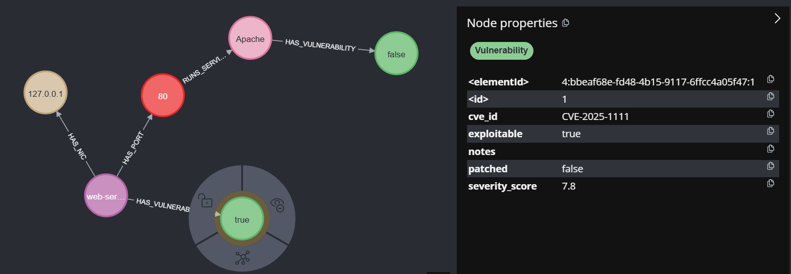

# What am I?
The Cyber Visualization Tools is a local, Neo4J backed visualization tool utilizing Neo4j community edition. It is meant to assist penetration testers in visualizing and organizing their notes, network maps, and other important items.

It is supposed to be a one-stop shop for enumeration, and will allow you to utilize Neo4Js powerful querying system to show potential attack vectors that may have been hidden before. 

## Local
The instance in entirely local so you can deploy this application alongside a fresh database to your machine. This keep your client's data safe so you can maintain ethical practices. 

## Technologies
Neo4j acts as our primary interface. It comes with a built-in webapplication which we can interact with, so all we have to do is parse notes and import it into Neo4J, and provide some pre-built queries for users to utilize. They can also use their own queries if they understand how Neo4J works!

We will use Python as our primary worker to parse data due to its extensive support with LLM libraries. When the user writes notes within Obsidian and have our plugin included, they can choose specific notes to send to Neo4J. If they are formatted correctly with a template included then the LLM will parse the data and import it directly into Neo4J for us!

## Templates
For the notes to be parsed correctly we require that they follow two standard formats
- **Headers**
    - Each "host block" MUST start with the word "Host:" followed by the hostname. Without the "Hosts" keywork our deterministic search method will miss the block, and the LLM won't be forced to retry that block and some information may be missed
    - Underneath this there is a little more freedom, but the Node Types (see below) must still be labeled or you risk missing information
    - I hope you would label these anyways, because otherwise I'm not sure how you would navigate your notes at a glance...
- **Indentation**
    - The LLM parses attribute and relationships stemming from a node through an indentation heirarchy, so for ex:
        ```markdown
        # Host: web-server
        - IP: 127.0.0.1
        ## Vulnerabilities
        - CVE-2025-1111 - Score: 7.8, Exploitable: true
        ## Open Ports
        - Port 80
            - Service: Apache 2.4
                - Vulnerabilities
                    - CVE-2024-5412
        ```
    - In the above example the (CVE-2025-1111) would be an attribute in a Vulnerability node belonging to web-server, while CVE-2024-5412 vulnerability node would belong to the Service Node (Apache) which relates to the port node 80. A NIC node with IP 127.0.0.1 would also be created belonging to web-server
    - In this way we can create complex and most importantly QUERIABLE network maps through just our markdown notes!
    

You can see some examples in ./template.md and in the /examples directory. Our LLM and Neo4J instance can currently handle the creation of 6 different nodes and 6 different relationships.  

## Queries
The single most powerful thing about using Neo4J is we can run queries on complex networks, which may illuminate attack vectors we haven't previously seen before. Some example queries can be seen in Neo4J_Cypher_Examples, and if you don't use cypher then almost all of modern AI systems can write one for you if you give it the hierarchy I show below

If you prefer to read Cypher, then you can see our full node types and relationships here:
- **Node Hierarchy:**
```cypher
(Host {name: string, os: string, notes: string})
  -[:HAS_VULNERABILITY]-> (Vulnerability {cve_id: string, severity_score: float, exploitable: bool, patched: bool, notes: string})
  -[:HAS_PORT]-> (Port {number: int, protocol: string})
    -[:RUNS_SERVICE]-> (Service {name: string, version: string, notes: string})
      -[:HAS_VULNERABILITY]-> (Vulnerability)
      -[:HAS_USER]-> (User {username: string, permission_level: string, source: string})
  -[:RUNS_SERVICE]-> (Service)  // Direct host services (no port)
  -[:HAS_USER]-> (User {username: string, password: string, permission_level: string, source: string})
  -[:HAS_NIC]-> (NIC {ip: string, mac: string})
    -[:CONNECTS_TO]-> (NIC)
```